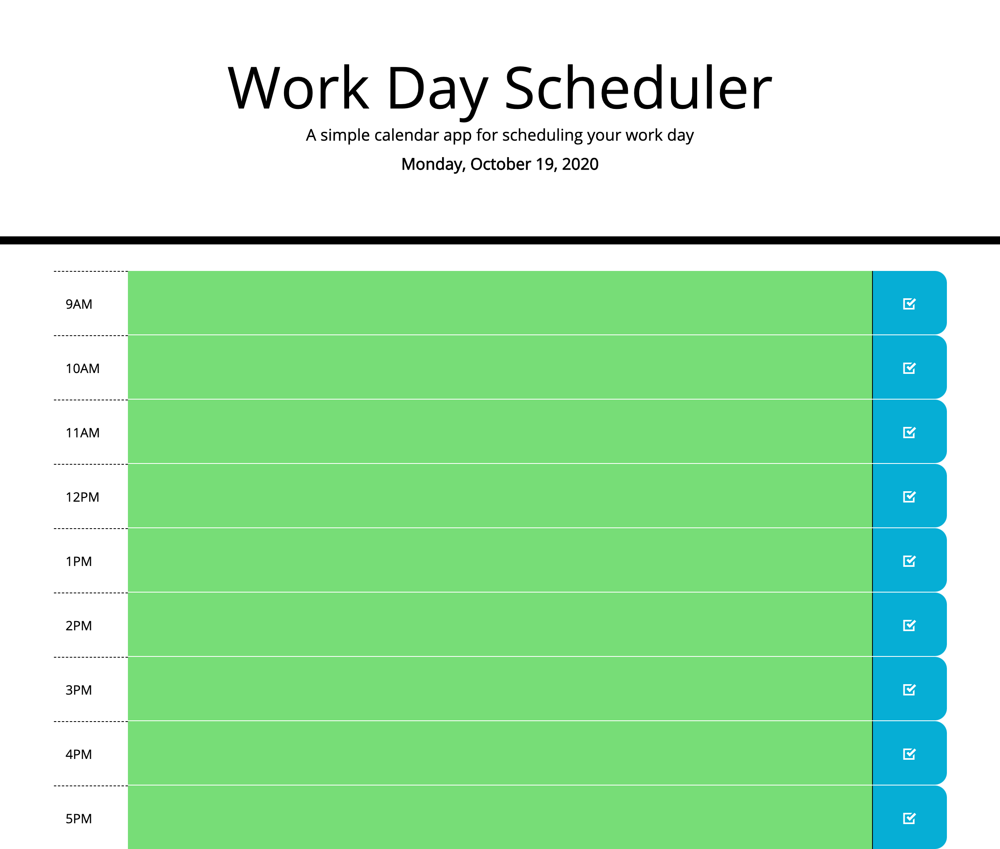

# Work Day Scheduler

## This Repository
In this repository you will find the code to a [Work Day Scheduler](https://gusmor94.github.io/work-day-scheduler/) that allows a user to click on different time blocks for standard business hours, and add events for that specific hour. The user will also notice that the time blocks will be color coded depending on the hour of the day. 

* Green for an hour in the future.
* Red for the current hour.
* Grey for an hour that has already passed.

When the user is finished typing their new event for a specific hour, they will then need to click on the blue "save button," in order to have it saved in the browser.

## My Process

With this app, I ran into a few issues, being that it was my first time using Bootstrap and Jquery. One this I found the most difficult was finding the right styles for what I wanted to execute, however, I was able to adjust some things with my own custom styling, as well as with continuing to refractor the code. Another issue I ran into was being able to retrieve the items from localStorage. After many hours and many attemtps, I realized I hadn't defined the properties to begin with, so each time I tried to call the function for them, there was nothing to apply. 

I am sure there are still many improvements that can be done with this project, as there always will be. However, being that it's still my first month in learning these techniques and languages, I'm happy to share the progress thus far.

Below is a screenshot of the working application:

